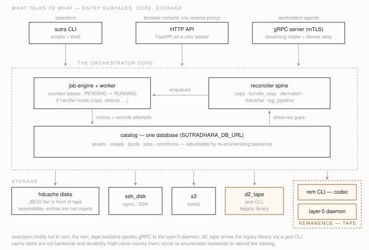
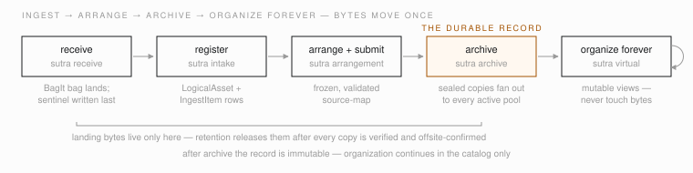
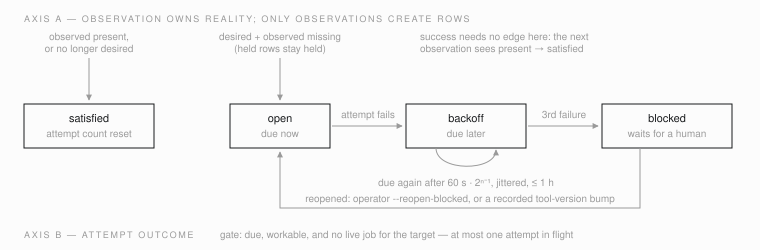
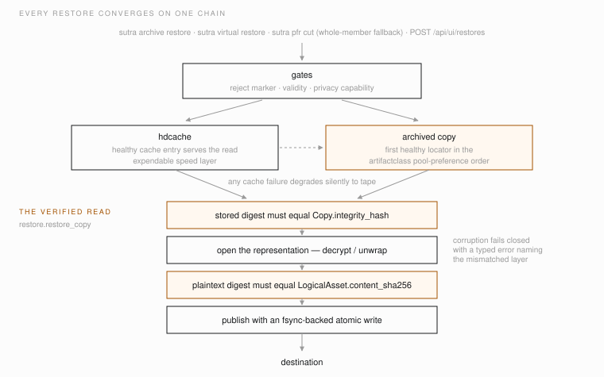

# Architecture overview

How Sutradhara is actually built, as of the commit in each section's
anchor. This is the map a newcomer should read after the README and before
the code. It describes what exists, not what was planned:
[`spec-v0.1.md`](spec-v0.1.md) holds the original design and its
first principles, and [`INDEX.md`](INDEX.md) tracks which designs became
code. Where this page and the code disagree, the code wins; please fix the
page.

<!-- code-anchor: none -->
## The one-paragraph version

Sutradhara is a content-addressed catalog plus a job engine, sitting above
storage backends (Remanence tape, legacy d2 tape, S3, SSH disk). Bytes
arrive as BagIt bags in a landing area, get registered into the catalog,
get arranged into an archive namespace, and get fanned out as sealed
copies to multiple pools. After that the archive is immutable; operators
keep organizing forever through virtual arrangements that never touch
bytes. A level-triggered reconciler spine notices gaps between desired and
observed state and enqueues jobs to close them. The database is
rebuildable by re-enumerating backends, so losing it is an inconvenience,
not a data-loss event.

*Fig. 1 — What talks to what: three entry surfaces over one catalog database, the reconciler enqueuing what the job engine runs, and storage below — amber marks the tape side, where copies are durable.*

<!-- code-anchor: src/sutradhara pyproject.toml @ 3d8310c -->
## The shape of the code

One Python package, `src/sutradhara/`, plus one workspace package. The
`sutra` CLI (`sutradhara.cli.main:cli`) is the main entry point;
`sutra serve` exposes the operator HTTP API and gRPC relay.

Subpackages:

| Package | What it holds |
|---|---|
| `catalog/` | SQLAlchemy models, enums, session helpers, and the single content-addressed funnel for recording copies (`copies.py`) and facts (`facts.py`). |
| `jobs/` | Job engine (`engine.py`), worker (`worker.py`), counted leases (`leases.py`), retry policy (`config.py`), attempt log (`attempts.py`), handlers (`handlers/`), and the reconciler spine (`reconcilers/`). |
| `backend/` | The storage port (`port.py`), the factory, and one adapter per backend kind. |
| `sealing/` | `Sealer`/`Opener` ports and the RAO codec that shells out to the Remanence `rem` CLI. |
| `keys/` | The local key registry for RAO-AEAD encryption epochs. |
| `hdcache/` | The expendable HD cache disk tier: store layout, fills, placement, walker, lifecycle, repopulation, restore manager, alarms. |
| `api/` | The FastAPI operator console API (`/api/...`), identity/capability parsing, the durable receive-intent/idempotency store (`store.py`), the card-history projection (`receive_history.py`), and the read models the browser console consumes. |
| `grpc/` | The mTLS gRPC server: streaming intake (`IntakeService`) and the device relay (`DeviceService`), an in-memory live-progress registry for active uploads (`progress.py`), plus enrollment admin. |
| `cli/` | Click command groups; see [`reference-cli.md`](reference-cli.md). |
| `receive/`, `member_name.py` | Compatibility aliases that re-export `sutradhara_receive` under old import paths. |
| `_proto/` | Generated protobuf stubs (`device`, `intake`, and Remanence `layer5`), regenerated by `scripts/regenerate-proto.sh` from `proto/`. |

The top-level modules carry most of the domain logic: `intake.py`
(acceptance boundary), `intake_watch.py` (landing registrar),
`arrangement.py` and `virtual_arrangement.py`, `archive_bundle.py` /
`archive_fanout.py` / `archive_submission.py` / `archive_restore.py`
(bundle build, fan-out, and restore), `staging.py` (pre-fanout
transforms), `replication.py` (copy policy and self-heal), `restore.py`
(the verified whole-copy read primitive), `retention.py` (the only code
that deletes bytes), `scrub.py`, `durability.py`, `pools.py`,
`artifactclass_policy.py`, `resource_control.py`, `pfr.py`, and
`logs_store.py`.

`packages/sutradhara-receive` is a separate, dependency-light package
that owns the first-contact receive contract (BagIt bag writing,
canonicalization, destination verification). It is a maturin project: the
canonical implementation is Python (`core.py`), with a Rust crate under
`rust/` that builds both a PyO3 native fast-path module and a standalone
`sutra-receive` edge binary. The Rust `~/sutra-agent` workstation helper
(a separate repository) links the same crate. The server imports the
package as `sutradhara_receive` via the uv workspace.

<!-- code-anchor: src/sutradhara/catalog/models.py src/sutradhara/catalog/types.py @ 3d8310c -->
## Data model

Two identities anchor everything:

- **`LogicalAsset`** (`logical_asset`) is content identity. Its primary
  key is the raw 32-byte SHA-256 of the content — no surrogate id, full
  dedup. It carries size, validity (`ok`/`suspect`/`unvalidated`), the
  reject marker, and media info.
- **`IngestItem`** (`ingest_item`) is occurrence identity: one row per
  appearance of an asset within an intake, with the as-received path and
  provenance. Two cards can carry the same bytes and get one
  `LogicalAsset` but two `IngestItem`s.

Around those, the catalog groups into five clusters:

**Intake**: `Intake` (a landing batch; status `receiving` → `verifying` →
`registered`, or `quarantined`; retention state `held` → `released` →
`purged`; carries an indexed `card_id`/`device_id` pair copied from the
gRPC intake row at registration, used to match a card against its own
receive history) and `AssetDerivation` (provenance edges between items,
e.g. transcodes).

**Arrangement and submission**: `Arrangement` + `ArrangementMember` are a
mutable pre-archive namespace over master ingest items (status `draft`,
`pending_derivatives`, `ready`, `submitted`, `abandoned`). `Submission` +
`SubmissionMember` mirror the frozen `source-map.tsv` an arrangement
freezes into (status `pending_archive` → `archived`). Submissions are
terminal; you revise by cloning the arrangement.

**Storage**: `Backend` (a registered backend instance; its
`implementation_family` — tape, d2tape, disk, cloud, memory — is derived
from the kind by an ORM event listener), `Pool` (the storage-policy
surface: representation, location, `offsite_gate`, write fence,
retired flag), `ArtifactClassPool` and `ArtifactClassPolicyRecord`
(which pools an artifactclass writes to, and the strict policy TOML bound
to it), `Bundle` + `BundleMember` + `StagingTransform` (synthetic archive
objects and per-member transforms), and the two grains of stored truth:

- **`Copy`** — one realization of a logical asset *or* a bundle on one
  backend (a check constraint enforces the XOR). Unique on
  `(backend_id, native_locator_key)`; carries `health`
  (`ok`/`suspect`/`corrupt`/`missing`), `integrity_hash`,
  `storage_metadata` (representation, key epoch), `last_verified_at`, and
  the retention tombstone `deleted_at`.
- **`AssetLocator`** — the per-asset pointer that lets a bundle-scoped
  `Copy` count as durable coverage for one asset, with the member path
  and representation.

`durability.py` computes placement status across both grains so callers
never conflate whole-asset copies with bundle membership. The default
durability floor — at least 3 copies across at least 2 implementation
families — is enforced when policies are applied and when pool write
fences change.

**Post-archive organization**: `VirtualArrangement` +
`VirtualArrangementMember` (permanently mutable views; member identity is
`(logical_asset_hash, artifactclass)`), `VirtualArrangementHistory`
(append-only move audit), and `AssetTag` (soft-deleted governance tags).

**Retention and audit**: `OffsiteConfirmation` (one row per confirmed
media id), `RetentionEvent` (append-only: `released`,
`cloud_blob_deleted`, `staging_deleted`), `ExclusionRecord` and
`ReviewDecision` (held-bundle review).

The job tables (`job`, `job_attempt`, `reconciliation_condition`) live in
`jobs/models.py`, and the hdcache tables (`cache_disk`, `cache_entry`,
`restore_request`, `restore_request_item`) in `hdcache/models.py` — same
metadata, same database.

<!-- code-anchor: none -->
## Lifecycle: receive to organize-forever

*Fig. 2 — The lifecycle at a glance; the numbered steps below name the code behind each stage.*

The intended flow, each step naming the code that implements it:

1. **Receive** (`sutradhara_receive`, `sutra receive`). A source tree is
   read once, hashed on read, and written to a landing share as a BagIt
   bag. The `intake.json` sentinel is written last, so a directory with a
   sentinel is complete by construction. Destination verification is
   recorded in a `verify.json` sidecar; `staged` mode releases the source
   card after the copy and verifies behind it, `blocking` verifies first.
   Online sources can instead stream through the gRPC `IntakeService`
   from the workstation agent.
2. **Register** (`intake.py`, `sutra intake register|watch`). Three
   explicit verbs: `inspect` validates without writing; `register`
   validates again and admits the intake — creating `LogicalAsset` and
   `IngestItem` rows and ensuring the cloud-temp disaster-recovery blob —
   keyed on an acceptance fingerprint so re-registration is idempotent;
   invalid never-accepted bags are quarantined. For device-relayed
   receives, `register` also copies the card/device identity from the
   gRPC intake row onto `Intake` and transitions the receive-intent
   record (see "Operator surface") to its terminal `committed` or
   `quarantined` state. `sutra intake watch` runs this as a polling
   registrar over the landing filesystem.
3. **Prepare** (`sutra prepare`). Records a derivation profile on the
   intake as desired state. The derivation reconciler later enqueues
   `transcode`/`pfr-index` jobs per the code registry in
   `jobs/reconcilers/profiles.py`; derived items re-enter the catalog as
   `IngestItem`s with their own artifactclass and get archived by that
   class's policy.
4. **Arrange and submit** (`arrangement.py`). Operators arrange
   registered masters into an archive namespace (`mv`, `exclude`), then
   `submit` freezes an immutable, validated source-map
   (`/replica/submissions/<id>/source-map.tsv`, mirrored to
   `submission_member` rows).
5. **Archive** (`archive_submission.py`, `archive_fanout.py`). `sutra
   archive submission flush` builds the arranged archive object straight
   from the original files via `rem archive build --map` (no staging
   copy), fans out to every active pool of the artifactclass — sealing
   per placement (plain RAO for the working copy, RAO-AEAD for offsite,
   d2 tar for the legacy shelf) — records the bundle `Copy` and
   per-member `AssetLocator`s, and flips the submission to `archived`.
   The accumulator path (`archive_bundle.py`, `sutra archive bundle
   enqueue/flush`) does the same for individually enqueued assets, with
   held-bundle review (`sutra review`) for messy input.
6. **Organize forever** (`virtual_arrangement.py`). Virtual arrangements
   are the permanent, mutable organizational layer over the archived
   truth: place, move, exclude, tag, reject — all catalog-only. Restore
   resolves a virtual path to the asset and goes through the normal
   restore gates.
7. **Release and reclaim** (`retention.py`). The retention gate releases
   an intake only when every recipe copy is verified and every
   offsite-gated placement's tape has an `OffsiteConfirmation`, and no
   arrangement or pending derivation still depends on the landing bytes
   (fail-closed). After release, `sweep-staging` deletes the landing
   bytes once the grace period (default 30 days) passes, and the
   cloud-temp blob is deleted immediately. Deletions run
   external-delete-before-DB and tombstone the `Copy` row rather than
   dropping it. Nothing else in the system deletes bytes.

Continuously, in the background: **scrub** (`scrub.py`) re-enumerates a
backend and reconciles it against the catalog (bump `last_verified_at`,
insert unknown objects, mark absentees `missing`, flag hash conflicts
`suspect` — never delete), and **self-heal** (`replication.py`) re-seals
missing placements from a healthy copy.

<!-- code-anchor: src/sutradhara/jobs @ 5c44b85 -->
## Job engine and reconciler spine

Intent lives in the catalog; jobs are ephemeral attempts. That is the
design rule (`design-reconciliation-model.md`), and the code follows it.

**Jobs** (`jobs/engine.py`). A `Job` row has a `kind`, JSON `params`,
counted resource requirements (`[{pool, count}]`), prerequisites,
priority (lower runs earlier), `not_before`, and an optional `dedupe_key`
enforced live-only by a partial unique index, so retrying a submit cannot
double-enqueue while a job is pending or running. Claiming is a guarded
`PENDING → RUNNING` update, deliberately shaped so a Postgres
`SKIP LOCKED` implementation can replace it in one place. `JobStatus` has
six values; `queued` and `cancelled` are declared but reserved — today the
engine moves jobs between `pending`, `running`, `succeeded`, and
`failed`. Every run appends an immutable `JobAttempt` transcript.

**Handlers** (`jobs/handlers/`). Registered kinds: `copy`,
`hdcache_fill`, `cloud-blob`, `restore`, `validate`, `pfr-index`,
`bundle-repair`, `transcode`, `verify`. (Naming is mixed hyphen/underscore
for historical reasons.)

**Worker** (`jobs/worker.py`, `sutra worker`). Single-node,
lease-aware. A `LeaseManager` keeps in-memory counted pools; the defaults
are `cpu` = CPU count, `io` = 2, `tape_drive` = 0, `gpu` = 0 — note that
drive- and GPU-requiring jobs can never be scheduled until you override
capacity with `--pools`. The worker claims jobs whose leases fit, runs
them on a thread pool, recovers orphaned `running` jobs at startup, and
refuses to run twice on one host via a PID lock file. Retry for plain
jobs is `apply_retry_policy` (default `max_attempts=1`; exponential
backoff with jitter, capped at 3600 s); reconciler-driven jobs skip it,
because their retry is the condition backoff below.

**Resource control** (`resource_control.py`). CPU-heavy subprocesses run
inside transient systemd scopes (`systemd-run --scope`) with
`CPUWeight`/`IOWeight` by role, so a transcode cannot starve a restore or
the tape daemon. `CPUWeight` is proportional fairness, not a cap. Without
systemd the wrapper degrades to plain execution with best-effort
`nice`/`ionice` (see the resource-control variables in
[`reference-config.md`](reference-config.md)).

**Reconciler spine** (`jobs/reconcilers/`). Five registered domains:
`copy` (per-asset pool coverage), `bundle_copy` (durability floor per
sealed bundle; enqueues `bundle-repair`), `derivation` (prepared
profiles), `hdcache` (cache convergence; enqueues `hdcache_fill`), and
`log_pipeline` (probes the VictoriaLogs pipeline). Each domain provides
`enumerate_targets` / `observe` / `reconcile_target`. One durable row per
`(domain, target_key)` — `ReconciliationCondition` — carries a two-axis
state machine:

- Axis A, observation: only `record_observation` creates rows. Desired
  and present → `satisfied`; desired and missing → `open` (unless the
  row is already held in `backoff`/`blocked`/`suppressed`).
- Axis B, attempt outcome: success clears the condition; failure sets
  `backoff` with exponential due times, escalating to `blocked` after 3
  attempts. Blocked rows wait for an operator (`sutra reconcile DOMAIN
  --reopen-blocked`) or a recorded tool-version bump, which reopens them
  automatically.

*Fig. 3 — One condition row, two axes: observations (top) own reality and are the only writer that creates rows; attempt outcomes (bottom) only escalate through `backoff` to `blocked`.*

`reconcile()` is one bounded cycle: reopen version-bumped rows, discover
a batch of targets, process due conditions, and enqueue at most one live
job per target. Level-triggered and idempotent: running it twice is safe,
and crashed state converges on the next cycle.

<!-- code-anchor: src/sutradhara/backend @ 5c44b85 -->
## Storage backends

The port (`backend/port.py`) is deliberately small: `enumerate()` yields
`CopyRecord`s, `read_range(locator, ByteRange)` returns bytes (the range
`[0, 0)` means the whole object), and `verify(locator)` re-checks one
object. `DeletableStorageBackend` adds `delete_object`, which must treat
already-absent as success. Errors are typed: transient
(`BackendTransientError`) vs session-invalidated vs not-found.

`backend/factory.py` builds an adapter from a `Backend` row:

| Kind | Adapter | Notes |
|---|---|---|
| `rem_tape` | `RemanenceBackend` | gRPC client to the Remanence layer-5 daemon (`config.daemon_endpoint`), or a fixture file for tests — exactly one of the two. Locator carries tape UUID, file number, LBA, object id; reads go through reusable read sessions. No `delete_object`. |
| `d2_tape` | `D2TapeBackend` | Bridges the legacy d2 tape library through a Java CLI fat jar; device state from `D2TAPE_*` env or `/var/lib/replica/d2tape/device.env`. No `delete_object`. |
| `ssh_disk` | `SshDiskBackend` | rsync/SSH to a plain file server (`config.host`, `config.root`). Writes go to a `.partial` then rename; enumeration re-hashes remote files with `sha256sum`; keys are validated against traversal. Has `delete_object`. |
| `s3` | `S3Backend` | boto3; `config.bucket` required, optional prefix/endpoint/storage-class. Has `delete_object`. Used for the cloud-temp intake blob. |
| `memory` | `MemoryBackend` | In-process dict, tests only. Has `delete_object`. |
| `rem_disk`, `plain_disk`, `gcs`, `azure_blob` | none | Valid `BackendKind` values that currently raise `UnsupportedBackendKind` — reserved names, no adapter yet. |

Since only memory, ssh_disk, and s3 implement `delete_object`, retention
can only reclaim copies on those kinds — which matches the design: tape
copies are the durable archive and are never deleted.

Backends also declare a `tier`: `self_describing` backends can rebuild
the catalog by enumeration (the scrub path proves it);
`catalog_authoritative` ones cannot.

<!-- code-anchor: src/sutradhara/sealing src/sutradhara/keys @ 5c44b85 -->
## Sealing and keys

A copy's on-backend form is its **representation**: `raw-bytes`
(passthrough), `rao-plain-v1` (unencrypted RAO container), `rao-aead-v1`
(AEAD-encrypted RAO), or `d2tar-raw` (legacy d2 tar, passthrough at
seal). The `Sealer`/`Opener` ports in `sealing/port.py` convert between
plaintext and stored form; `RaoCliSealer`/`RaoCliOpener` implement them by
shelling out to the Remanence `rem` CLI (`rem archive build/extract`) as
a stateless local codec — by explicit decision there is no sealing daemon
or service. RAO builds are deterministic: fixed chunk size (262144),
fixed timestamp, and UUIDs derived from the plaintext digest, so the same
input seals to the same object. `inspect_rao` recovers a stored object's
representation and key id from its header without any key.

Encrypted copies name a **key epoch** from the `KeyRegistry`
(`keys/registry.py`): root keys live under the registry directory, are
materialized into short-lived `0600` files (in `XDG_RUNTIME_DIR`,
`/run/user/<uid>`, or `/dev/shm`) only for the duration of a `rem` call,
and are never deleted by epoch retirement. Epochs are domain-tagged
(`archive` vs `hdcache`) and the code asserts the domain at use.

<!-- code-anchor: src/sutradhara/hdcache @ 5c44b85 -->
## The HD cache tier

`hdcache/` is a speed layer of independent JBOD disks in front of tape.
It is expendable by construction: cache state derives from archival truth
and never joins it — cache disks are not backends, cache entries are not
copies, and no durability math ever counts them. `cache_disk` rows track
enrollment and lifecycle (`active`, `absent`, `retiring`, `dead`);
`cache_entry` rows (`filling`, `present`, `lost`) hold one representation
per asset, `raw-bytes` or `rao-aead-v1` for private material.

Fills are jobs on the reconciler spine (domain `hdcache`), bounded by a
live-job cap and priority-ordered below operator restores and above
migrations. Placement is size-gated anti-affinity: large files from the
same bundle or group land on different disks so restores can stream in
parallel. The walker is the cache-local scrub (unknown file → delete;
missing entry → repopulate), with HMAC-signed disk sentinels proving disk
identity before anything destructive. A dead disk flips its entries to
`lost` and a tape-grouped repopulation drill refills them; a retiring
disk drains through verified local reads first. `sutra hdcache rebuild`
can repropose rows from the self-describing on-disk filenames, held
untrusted until cross-checked against the catalog.

Serving sits behind one seam: `resolve_read_source` applies the privacy
and validity gates and then picks cache or tape; any cache failure
degrades silently to tape. Encrypted entries are staged through scratch
under a separate stream cap. Operator restores enter through
`admit_restore_request` (capability, privacy, validity checks recorded on
the request items) and are served by `restore` jobs.

<!-- code-anchor: src/sutradhara/restore.py src/sutradhara/archive_restore.py src/sutradhara/hdcache/manager.py @ 5c44b85 -->
## The restore path

Every restore, whatever the entry point (`sutra archive restore`,
`sutra virtual restore`, `sutra pfr cut` fallback, `POST
/api/ui/restores`), converges on the same chain:

1. Gates: reject marker and validity on the asset
   (`check_asset_restore_allowed`; `--force` / `--force-rejected`
   override suspect/rejected explicitly), plus privacy capability for
   hdcache-classed material.
2. Source choice: `resolve_read_source` serves from cache when a healthy
   entry exists, otherwise falls to tape;
   `archive_restore.restore_asset` picks the first healthy locator in the
   artifactclass's `restore.preference` pool order.
3. The verified read: `restore.restore_copy` reads the stored object,
   checks stored bytes against `Copy.integrity_hash`, opens the
   representation (decrypt/unwrap), checks plaintext against
   `LogicalAsset.content_sha256`, and only then publishes to the
   destination with an fsync-backed atomic write. Corruption fails
   closed with a typed error naming which layer mismatched.

*Fig. 4 — The restore chain: whatever the entry point, gates first, cache before tape, and both hash checks (amber) before anything reaches the destination.*

Partial file restore (`pfr.py`, `sutra pfr cut`) shortcuts step 3 for
indexed members: a `pfr-index-v1` sidecar plus `ReadObjectRange` byte
ranges let ffmpeg cut a clip without reading the whole object, through a
bounded local blob cache, with a fallback ladder down to whole-member
restore.

<!-- code-anchor: src/sutradhara/api src/sutradhara/grpc proto @ 3d8310c -->
## Operator surface

The HTTP API (`api/app.py`, FastAPI) binds to a Unix socket behind a
reverse proxy and trusts the proxy's identity headers
(`X-Authentik-Username/-Name/-Email/-Groups`); there is no token parsing
in-process, and the deployment invariant is that the proxy strips
client-supplied copies of those headers. Groups map to capabilities
fail-closed: `sutradhara-ingest` → view+receive, `sutradhara-restore` →
view+restore, `sutradhara-oversight` → view, `sutradhara-troubleshoot` →
view+logs, `sutradhara-admin` → view+admin, and `sutradhara-restore-p2`/
`-p3` add the privacy capabilities. Mutating requests must be
same-origin `application/json` (the enrollment CSR endpoint is the
documented exception).

Endpoint families: `/api/session`, `/api/receive*`, `/api/devices*` and
`/api/enroll/*` (the device relay and enrollment), `/api/activity`, and
the read models the browser console renders — `/api/ui/restores` and
`/api/ui/restore-requests`, `/api/ui/reconciliation` (conditions plus
hdcache alarms, the "gap board"), `/api/ui/jobs`, `/api/ui/resources`,
`/api/ui/intakes`, `/api/ui/archive/*`, `/api/ui/catalog/assets`,
`/api/ui/library/*`, `/api/ui/logs`. The read-model shapes are frozen in
the `contract-*-readmodel.md` docs in this directory.

The gRPC server (`grpc/server.py`) is mTLS with client-auth required,
binding two services from `proto/`: `IntakeService` (a workstation agent
streams card/drive payloads; the server assembles a standard BagIt intake
and hands off to the same registration path as any other landing) and
`DeviceService` (one outbound bidi stream per enrolled helper, over which
the console relays receive commands and folder browsing). Bind addresses
are validated to loopback, private ranges, or Tailscale — a wildcard bind
is refused. Device enrollment is certificate-based: mint a token, sign
the device CSR, `CN = device_id`; `.sutra-enroll` bundles package the
whole thing for one-click laptop setup. A process-local
`ReceiveProgressRegistry` (`grpc/progress.py`) tracks live per-file byte
progress for active streaming uploads so the HTTP console can poll it
during a receive; it is memory-only, rebuilt from the landing receipt
ledger (`receive-receipts.jsonl`) on restart, and never the durable
record of what was received.

**Duplicate-card receive handshake** (`api/store.py`, `api/routes_devices.py`,
`api/receive_history.py`; schema in migration `d4e5f6a7b8c9`). Before any
bytes move over `POST /api/devices/{device_id}/receive`, the server checks
the requested card's identity against a server-side, server-timestamped
history projection (`latest_card_history`) of every prior receive attempt
for that card. A match returns HTTP 409 with a `duplicateWarning` body
(prior intake id, label, device, timestamp, and state — redacted to
`visible: false` when the requester can't see the earlier operator's
intake); the caller resubmits the same request with
`acknowledge_duplicate: true` to proceed. This reuses and extends the
existing per-request idempotency table (`IdempotencyRecord`, now also
storing device/card identity and duplicate-warning state) into a durable
**receive-intent state machine**: `warned → authorized → started →
terminal(committed|aborted|quarantined|failed)`. A **source lease**
(`SourceClaim`, keyed `card-identity:<card_id>`) is acquired at
`authorized` so two concurrent receives of the same physical card can't
race; a second request gets a `source_busy` 409 instead of clobbering the
first. The gRPC `StartIntake` RPC now requires a matching `authorized` (or
resumable `started`) intent minted by this HTTP handshake — `claim_start_intake`
links the two — so a streaming upload cannot begin without having passed
the duplicate check; `intake.register_intake` transitions the intent to
its terminal state (`committed` or `quarantined`) as the last step of
catalog acceptance. `/api/devices` card entries carry a `receivedBefore`
badge from the same projection, and the intake archive read models add an
additive `archive_state` (`none`/`partial`/`complete`, ALL-semantics over
every ingest item's hash) alongside the legacy any-semantics `archived`
boolean.

<!-- code-anchor: alembic @ 3d8310c -->
## Migrations

Schema history is alembic, in `alembic/`: 29 migrations in a single
linear chain from `ea7254a77d7a` (the initial
logical-asset/backend/copy tables) to head `d4e5f6a7b8c9` (receive-dedup
phase 1a: durable receive-intent columns on the idempotency table, plus
`card_id`/`device_id` on `Intake`). The chain tracks the system's growth:
job table, pools, staging transforms, leases, the reconciler spine,
arrangements and submissions, virtual arrangements, retention, gRPC
intake and relay state, the hdcache tier, restore admission, and
copy-grain durability. `alembic/env.py` resolves the database from
`SUTRADHARA_DB_URL` exactly like the runtime. `sutra db init`
(create-all) exists for development; production schema changes go
through `alembic upgrade head`.

<!-- code-anchor: none -->
## Known rough edges

Honest notes a newcomer would otherwise trip on:

- `JobStatus.queued` and `JobStatus.cancelled` exist in the enum and the
  CLI filter but are reserved; nothing sets them today.
- Default worker capacities make `tape_drive` and `gpu` zero; jobs
  requiring them sit unschedulable until you pass `--pools`.
- `rem_disk`, `plain_disk`, `gcs`, `azure_blob` are accepted by
  `sutra backends add --kind` but raise `UnsupportedBackendKind` when the
  backend is actually used.
- Job kind names mix hyphens and underscores (`cloud-blob` vs
  `hdcache_fill`).
- `replicate.py`, `sutradhara/receive/`, and `sutradhara/member_name.py`
  are thin compatibility shims; new code should import `replication` and
  `sutradhara_receive` directly.
