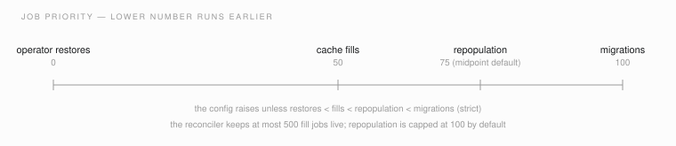

# Configuration reference

Every environment variable Sutradhara reads, with its exact default and
where in the source it is read. This page was built by grepping
`src/` and `packages/` for `os.environ` and reading each call site; the
file path in each table row is the place to check if you suspect drift.

There is no configuration file. Everything is environment variables plus
per-backend `config` JSON stored on the `backend` row (see
`sutra backends add --config`) and the per-artifactclass policy TOML
(see `sutra archive artifactclass apply`).

Types: "bool" variables accept `1`, `true`, `yes`, `on` and `0`, `false`,
`no`, `off` (case-insensitive); anything else raises. Numeric variables
raise on non-numeric values. An empty string is treated the same as unset
in the hdcache/placement helpers.

<!-- code-anchor: src/sutradhara/catalog/session.py src/sutradhara/rem_archive_cli.py src/sutradhara/keys/registry.py src/sutradhara/jobs/config.py src/sutradhara/jobs/worker_lock.py src/sutradhara/logs_store.py src/sutradhara/retention.py @ 46bb240 -->
## Core

| Variable | Default | Purpose |
|---|---|---|
| `SUTRADHARA_DB_URL` | `sqlite:///./sutradhara.db` | SQLAlchemy URL of the catalog database. The default is a SQLite file in the current working directory, so long-lived deployments should always set this. Alembic resolves the same variable (`alembic/env.py`). SQLite engines get WAL mode and foreign-key enforcement turned on. (`catalog/session.py`) |
| `REM_BIN` | see below | Path to the Remanence `rem` CLI used for REM-OBJECT sealing, opening, and archive builds. Resolution order: an explicit `--rem-bin` flag, then `REM_BIN`, then `rem` on `PATH`, then `~/remanence/target/release/rem`. A missing binary raises `FileNotFoundError` with that list. (`rem_archive_cli.py:resolve_rem_bin`) |
| `SUTRADHARA_KEY_REGISTRY_DIR` | `/var/lib/replica/sutradhara-key-registry` | Root of the local REM-ENCRYPT X-Wing epoch registry. Create it with service-user ownership and mode `0700`; hot-domain raw 32-byte seed files and JSON state are `0600`, while non-secret REMR public files are `0644`. Recovery epochs are public-only imports: their private half must never be placed here. Retiring an epoch never deletes retained key material. (`keys/registry.py`) |
| `SUTRADHARA_CACHE_ROOT` | `/var/lib/replica/cache` | Derivation cache root where transcode/index outputs are written before archiving. `sutra reconcile --cache-root` overrides it for one run. (`jobs/config.py:derivation_cache_root`) |
| `SUTRADHARA_STATE_DIR` | unset | Where the worker's single-instance lock file goes for non-file database URLs: `$SUTRADHARA_STATE_DIR/worker-locks`, else `$XDG_STATE_HOME/sutradhara/worker-locks`, else `~/.local/state/sutradhara/worker-locks`. SQLite file URLs ignore this and lock next to the database file (`<database>.worker.lock`). (`jobs/worker_lock.py`) |
| `SUTRADHARA_RETENTION_JOURNAL_DIR` | beside a file-backed SQLite catalog; otherwise under the state directory | Root for authoritative UTC-dated retention-journal JSONL segments. |
| `SUTRADHARA_RETENTION_JOURNAL_DR_BACKEND` | unset | Exact catalog backend name used for journal DR shipping; it must be an explicitly configured `ssh_disk` backend. Missing configuration alarms but never gates retention. |
| `SUTRADHARA_RETENTION_JOURNAL_DR_PREFIX` | `retention-journal` | Validated relative prefix below the selected `ssh_disk` root for dated segments and head anchors. |
| `SUTRADHARA_RETENTION_JOURNAL_STALE_SECONDS` | `7200` | Positive age threshold for the oldest unexported receipt before the non-gating staleness alarm opens. |
| `SUTRADHARA_LOG_STORE_URL` | `http://127.0.0.1:9428` | Base URL of the VictoriaLogs instance backing `/api/ui/logs` and the `log_pipeline` reconciler. (`logs_store.py`) |
| `SUTRADHARA_CLOUD_KEY_EPOCH` | unset | `backup-<32hex>` hot epoch used by the `cloud-blob` job when params do not carry one. When unset, the active backup epoch is created or reused. Sealing also requires an imported active recovery public epoch. (`jobs/handlers/cloud_blob.py`) |
| `SUTRADHARA_REM_STREAM_MOUNT_GRACE_SECONDS` | `600.0` | Seconds allowed for a synchronous Remanence tape session open (robot mount plus locate) before an AEAD `extract-stream` restore is aborted. Once the session opens, the separate fixed 120-second streaming inactivity timeout applies. (`archive_restore.py`) |
| `SUTRADHARA_OPERATOR_RESTORE_PRIORITY` | `0` | Job priority for operator restores (lower runs earlier). Must stay below the hdcache fill priority; the config constructor raises otherwise. (`hdcache/fill.py`) |
| `SUTRADHARA_MIGRATION_PRIORITY` | `100` | Job priority for migration work. Must stay above the hdcache fill priority. (`hdcache/fill.py`) |
| `SUTRADHARA_RETENTION_LANDING_ROOTS` | unset (falls back to `SUTRA_RECEIVE_LANDING_ROOT`, or `/replica/landing`) | `os.pathsep`-delimited list of additional absolute landing roots the staging-sweep purge path treats as valid, symlink-checked intake locations. (`retention.py`) |
| `SUTRADHARA_RETENTION_TOMBSTONE_ROOT` | unset (`<first landing root>/.retention-tombstones`) | Overrides where retention tombstone marker files are written and validated during a staging-sweep purge — see "Deletion evidence and the retention witness gate" in `architecture-overview.md`. (`retention.py`) |

The current registry accepts only REM-ENCRYPT X-Wing REMR/REMP material. An
older RAOR/RAOP registry cannot be relabelled: move it intact to a protected
backup and initialize new epochs, or perform a separately designed migration
when old encrypted objects must remain readable.

<!-- code-anchor: src/sutradhara/cli/api.py src/sutradhara/api/app.py src/sutradhara/api/sources.py @ 5688438 -->
## Operator API and servers

| Variable | Default | Purpose |
|---|---|---|
| `SUTRA_API_SOCKET` | `/run/sutradhara/api.sock` | Unix domain socket path the operator HTTP API listens on (`sutra serve` / `sutra serve-api`). The `--api-socket`/`--socket` flags override it. (`cli/api.py`, `cli/serve.py`) |
| `SUTRA_AGENT_BUNDLE_CONFIG` | unset | Path to the deployment JSON that `POST /api/enroll/bundle` embeds into `.sutra-enroll` enrollment bundles (enroll URL, CA PEM path, endpoint list, console URL — see `docs/examples/agent-bundle.dev.json`). When unset or missing, the endpoint returns `bundle_not_configured` and the server logs a warning at startup. (`api/app.py`) |
| `SUTRA_RECEIVE_SOURCE_ROOT` | `/replica/sources` | Root under which the API's server-side receive resolves operator-selected source ids. (`api/sources.py`) |
| `SUTRA_RECEIVE_LANDING_ROOT` | `/replica/landing` | Landing root the API's server-side receive writes bags into. (`api/sources.py`) |

<!-- code-anchor: src/sutradhara/resource_control.py @ 5688438 -->
## Resource control

Sutradhara runs CPU-heavy subprocesses (`ffmpeg`, `rem`, `ffprobe`, the PFR
index worker) inside transient systemd scopes so the kernel enforces fair
CPU sharing. These variables control that wrapper.

| Variable | Default | Purpose |
|---|---|---|
| `SUTRADHARA_RESOURCE_CONTROL` | `auto` | Set to `0`, `off`, `false`, `disabled`, or `degraded` to skip systemd scopes entirely and run subprocesses plainly (with best-effort `nice`/`ionice`). |
| `SUTRADHARA_RESOURCE_CONTROL_SYSTEMD` | `user` | Which systemd manager to use: `user` (or `systemd-user`) vs `system` (or `systemd-system`). Anything else raises. |
| `SUTRADHARA_RESOURCE_CONTROL_REQUIRE` | unset (off) | When truthy (`1`, `on`, `true`, `yes`, `require`, `required`), a failed capability probe raises `ResourceControlUnavailable` instead of degrading to plain execution. Degradation is otherwise logged once per process. |
| `SUTRADHARA_RESOURCE_CONTROL_PROBE_TIMEOUT` | `2.0` | Seconds allowed for the `systemd-run` capability probe, clamped to at least `0.1`. Non-numeric values silently fall back to `2.0`. |

<!-- code-anchor: src/sutradhara/hdcache/fill.py src/sutradhara/hdcache/manager.py src/sutradhara/hdcache/placement.py src/sutradhara/hdcache/repopulate.py src/sutradhara/hdcache/lifecycle.py src/sutradhara/hdcache/store.py src/sutradhara/artifactclass_policy.py @ 5688438 -->
## HD cache tier

The hdcache subsystem reads its knobs at call time through
`fill_config_from_env()`, `restore_config_from_env()`,
`placement_config_from_env()`, and `repop_config_from_env()`, so a restart
of the relevant process picks changes up.

### Fills and job scheduling

| Variable | Default | Purpose |
|---|---|---|
| `SUTRADHARA_HDCACHE_LIVE_JOB_CAP` | `500` | Maximum live `hdcache_fill` jobs the reconciler keeps in flight. |
| `SUTRADHARA_HDCACHE_FILL_PRIORITY` | `50` | Priority of fill jobs. Must sit strictly between the operator-restore priority (default 0) and the migration priority (default 100); the config raises otherwise. |
| `SUTRADHARA_HDCACHE_REPOP_LIVE_JOB_CAP` | unset | Cap for repopulation fills after a disk death. When unset the effective cap is `min(live_job_cap, max(1, live_job_cap // 5))` — 100 with the defaults. |
| `SUTRADHARA_HDCACHE_REPOP_PRIORITY` | unset | Priority for repopulation jobs. Must sit strictly between fill and migration priority. When unset the effective value is their midpoint — 75 with the defaults. |
| `SUTRADHARA_HDCACHE_SCRATCH_ROOT` | two defaults, see note | Scratch directory for staging bytes. Note: the fill path defaults to `/var/lib/replica/hdcache-scratch` and the restore/serve path defaults to `/var/lib/replica/hdcache-restore-scratch`, but both read this one variable — setting it points fills and restores at the same directory. |
| `SUTRADHARA_HDCACHE_IDENTITY_PROBE_DEADLINE_SECONDS` | `2.0` | Deadline for the disk identity probe before a fill writes. Must be positive. |
| `SUTRADHARA_HDCACHE_DELETE_DEADLINE_SECONDS` | `70.0` | Deadline for entry deletion I/O during fills/walks. Must be positive. |

*Fig. 1 — How the four priority knobs relate: lower runs earlier, and the config refuses any setting that breaks the strict ordering.*

### Restore serving

These knobs bound the same verified cache-chunk producer used by both
restore delivery modes: server-local restore (`restore` jobs, which fall
back to tape on any cache failure) and agent-delivered restore over gRPC
(`OpenRestore`, which falls back only to a disk-backed archive candidate,
never tape — see "The restore path" in `architecture-overview.md`).

| Variable | Default | Purpose |
|---|---|---|
| `SUTRADHARA_HDCACHE_STREAM_POOL_SIZE` | `24` | Parallel restore streams served from cache disks. |
| `SUTRADHARA_HDCACHE_AEAD_STREAM_CAP` | `4` | Concurrent AEAD (encrypted) cache serves; these stage through scratch, so they are capped separately. |
| `SUTRADHARA_HDCACHE_WAKE_AHEAD` | `true` | Wake spun-down disks ahead of their turn in the stream queue. |
| `SUTRADHARA_HDCACHE_WAKE_WINDOW_SIZE` | unset | How many queued items ahead to wake disks for. When unset: `stream_pool_size * 2` (48 with the defaults). |
| `SUTRADHARA_HDCACHE_READ_DEADLINE_SECONDS` | `70.0` | Per-read deadline before a cache stream is abandoned and the item falls back per its delivery mode (tape for server-local, a disk-backed archive candidate for agent delivery). |
| `SUTRADHARA_HDCACHE_LIVENESS_PROBE_DEADLINE_SECONDS` | `2.0` | Deadline for the disk liveness probe used by the serve-side circuit breaker. |
| `SUTRADHARA_HDCACHE_RESTORE_DESTINATIONS` | unset (`{}`) | JSON object mapping destination id to either a root path string or `{"root": ..., "label": ..., "writable": ...}`. Destination ids must not look like paths, and labels must not be raw paths; violations raise at parse time. This is what `/api/ui/restore-destinations` serves. |
| `SUTRADHARA_HDCACHE_PRIVACY_CAPABILITIES` | `{"p2": "can_restore_p2", "p3": "can_restore_p3"}` | JSON object mapping an artifactclass `privacy_level` to the API capability required to restore it. Fail-closed: an asset whose privacy level has no mapping is denied (`privacy_unmapped`). |

### Placement

| Variable | Default | Purpose |
|---|---|---|
| `SUTRADHARA_HDCACHE_SPREAD_MIN_BYTES` | `1073741824` (1 GiB) | Anti-affinity size gate: files at or above this size are spread across distinct disks; smaller same-group files may co-locate. |
| `SUTRADHARA_HDCACHE_ENCLOSURE_SPREAD` | `false` | Prefer placing spread copies in different enclosures, not just different disks. |
| `SUTRADHARA_HDCACHE_RESERVE_FRACTION` | `0.02` | Fraction of each disk kept free. |
| `SUTRADHARA_HDCACHE_RESERVE_LARGEST_EXPECTED_FILE_BYTES` | `0` | Extra reserve sized to the largest file you expect to place. |
| `SUTRADHARA_HDCACHE_RESERVE_TMP_HEADROOM_BYTES` | `0` | Extra reserve for temp files during fills. |

### Repopulation (after disk death or retirement)

| Variable | Default | Purpose |
|---|---|---|
| `SUTRADHARA_HDCACHE_REPOP_SCRATCH_ROOT` | `/var/lib/replica/hdcache-repopulate-scratch` | Scratch directory for tape-grouped repopulation extraction. |
| `SUTRADHARA_HDCACHE_REPOP_BATCH_SECONDS` | `1800` | Target wall-clock size of one tape-grouped repopulation batch. |
| `SUTRADHARA_HDCACHE_REPOP_TAPE_BYTES_PER_SECOND` | `314572800` (300 MiB/s) | Assumed tape read rate used to size batches and estimate drill ETAs. |
| `SUTRADHARA_HDCACHE_DRAIN_READ_DEADLINE_SECONDS` | `70.0` | Per-read deadline during retire-drain (verified local reads off a retiring disk). |

### Disk sentinels

Enrolled disks carry an HMAC-signed identity sentinel so the walker can
prove it is looking at the disk the catalog thinks it is.

| Variable | Default | Purpose |
|---|---|---|
| `SUTRADHARA_HDCACHE_HMAC_SECRET` | unset | Inline sentinel secret (UTF-8). When unset, the secret is read from the key file `/var/lib/replica/hdcache-disk-hmac.key`; an empty key file raises. (`hdcache/lifecycle.py`, `hdcache/store.py`) |
| `SUTRADHARA_HDCACHE_HMAC_SECRET_HEX` | unset | Hex-encoded sentinel secret for the fill config path; same fallback to the key file when unset. (`hdcache/fill.py`) |

<!-- code-anchor: src/sutradhara/pfr.py @ 5688438 -->
## Partial file restore

| Variable | Default | Purpose |
|---|---|---|
| `SUTRADHARA_PFR_BLOB_CACHE_BYTES` | `21474836480` (20 GiB) | Size of the local LRU cache of fetched archive blobs that serves partial reads. Must be non-negative; `0` disables caching. |
| `SUTRADHARA_PFR_SCRATCH_ROOT` | `/var/lib/replica/pfr-scratch` | Scratch directory for PFR cuts and the blob cache. |

<!-- code-anchor: src/sutradhara/jobs/handlers/cloud_blob.py src/sutradhara/jobs/handlers/transcode.py @ 5688438 -->
## Test and harness knobs

Set only in tests and CI; never in production.

| Variable | Effect when `1` |
|---|---|
| `SUTRADHARA_FAKE_CLOUD_BLOB` | The `cloud-blob` handler writes a deterministic JSON stand-in instead of running `rem archive build`. |
| `SUTRADHARA_FAKE_TRANSCODE` | The `transcode` handler fabricates mezz/preview outputs instead of running ffmpeg. |

Additionally, `tests/test_s3_backend.py` runs its live-MinIO test only when
both `SUTRADHARA_MINIO_ENDPOINT` and `SUTRADHARA_MINIO_BUCKET` are set;
otherwise it skips.

<!-- code-anchor: src/sutradhara/backend/d2tape.py @ 5688438 -->
## d2tape backend

The `d2_tape` backend bridges the legacy d2 tape library through a Java
CLI. Each of these is read from the process environment first, then from
the device file `/var/lib/replica/d2tape/device.env` (a `KEY=value` file;
the path is configurable via the backend row's `device_env_path`).

| Variable | Default | Purpose |
|---|---|---|
| `D2TAPE_DEVICE` | none (required) | Tape device node. Missing device state raises `BackendUnavailableError`. |
| `D2TAPE_BARCODE` | none (required) | Barcode of the mounted volume. |
| `D2TAPE_VOLUME_BLOCKSIZE` | `256000` | Volume block size. |
| `D2TAPE_ARCHIVE_BLOCKSIZE` | `512` | Archive block size. |
| `D2TAPE_VOLUME_UUID` | unset | Explicit volume UUID; otherwise resolved from per-barcode state under `/var/lib/replica/d2tape/volumes`. |
| `D2TAPE_STINIT_SCRIPT` | unset | Optional stinit script passed to the CLI. |
| `D2TAPE_JAR` | newest `~/d2tape/d2tape-cli/target/d2tape-cli-*-jar-with-dependencies.jar` | Path to the d2tape CLI fat jar. Env-only (not read from `device.env`). |

<!-- code-anchor: src/sutradhara/jobs/worker_lock.py src/sutradhara/keys/registry.py @ 46bb240 -->
## Standard variables Sutradhara also honors

| Variable | Used for |
|---|---|
| `XDG_STATE_HOME` | Worker lock directory when `SUTRADHARA_STATE_DIR` is unset. |
| `XDG_RUNTIME_DIR` | First candidate for the private `0700` temp directory where short-lived `0600` REMP private-key files are materialized (then `/run/user/<uid>`, `/dev/shm`, and the platform temp directory). |
| `USER` | Default operator attribution on receives, submissions, retention actions, tags, and virtual-arrangement edits. |
| `JAVA_HOME` | Passed through to the d2tape CLI subprocess when the backend row configures `java_home`. |
